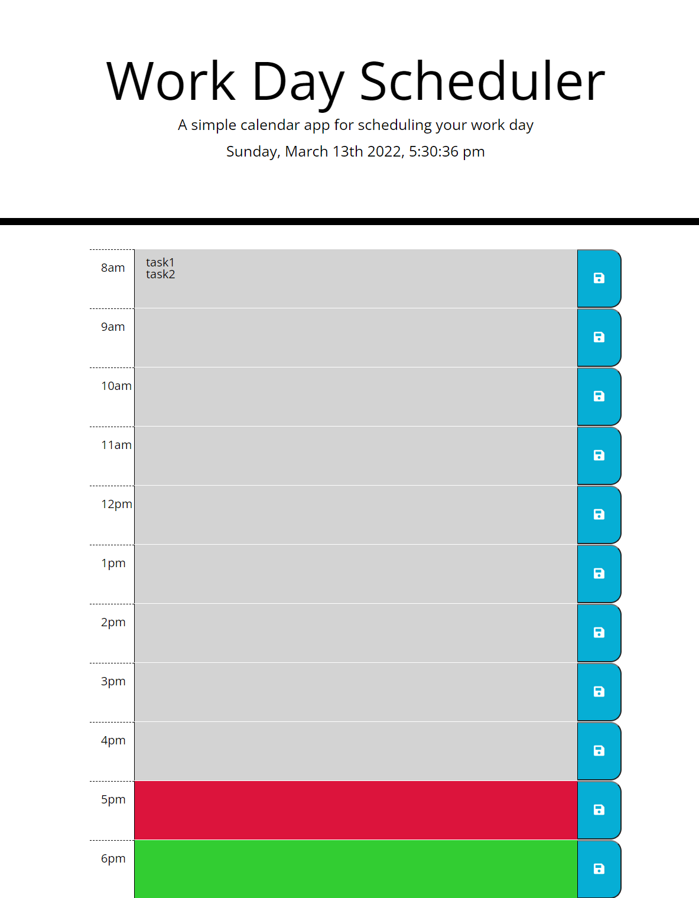

# Workday Scheduler

## Purpose
A website that allows the user to schedule tasks on a color-coded daily planner.

## Built With
HTML
CSS
JavaScript

## Frameworks/Libraries
jQuery
Bootstrap
Moment.js

## Website
https://kmelter.github.io/work-day-scheduler/

## Repository Link
https://github.com/kmelter/work-day-scheduler

## Screenshot
